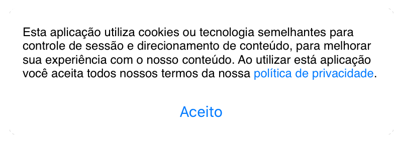
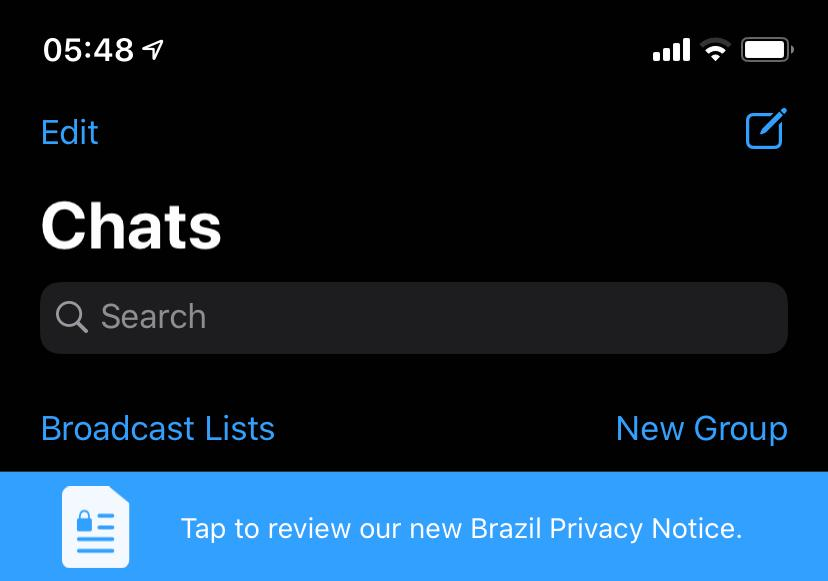
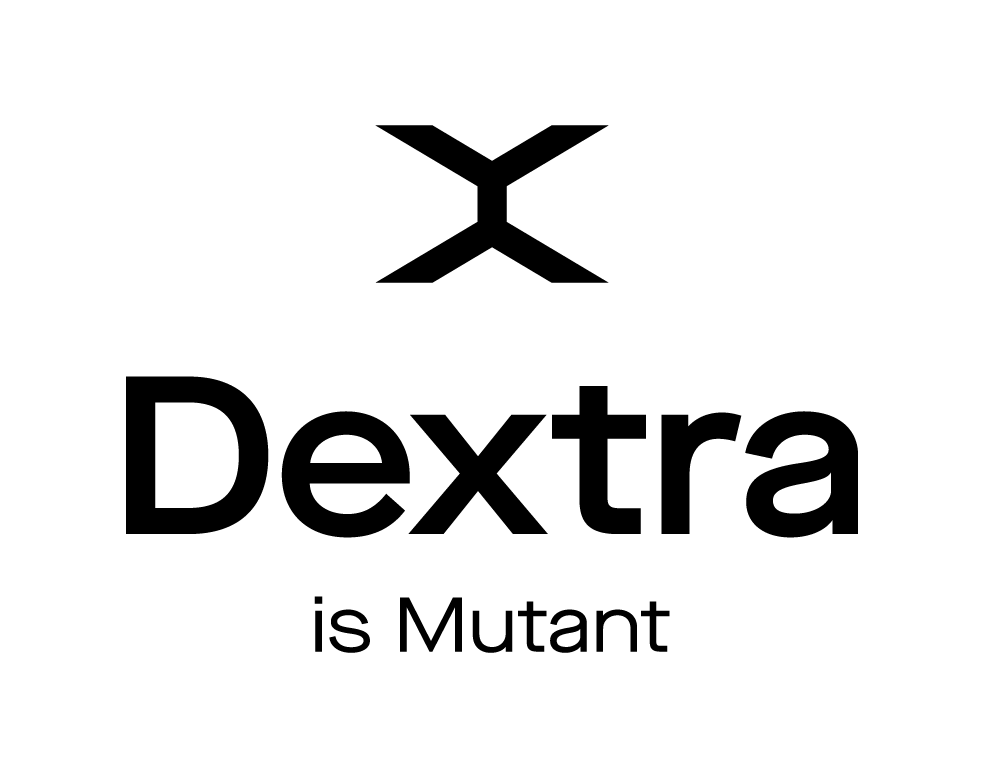

<!-- _class: invert -->

Vencendo a LGPD com Windows :computer:
===
###### ou sendo derrotado...

---
<!-- _class: invert -->

Quem é o Túlio?
===

- Bacharel em Ciência da Computação
- iOS Developer - 6+ anos
    - BEPiD
- Dextra - 4+ anos
- pai do Théo 👶 e do Maui 🐶
- ~~Magic e Pokémon~~
- **Não sou advogado**!


---

<!--fit-->
Mas afinal... O que é LGPD?
===

---

[Lei Geral de Proteção de Dados Pessoais (LGPD)](http://www.planalto.gov.br/ccivil_03/_ato2015-2018/2018/lei/L13709.htm)
===

Inspirada na ***GDPR Européia***, essa lei regula como dados pessoais são coletados, utilizadados, acessados, distribuidos, processados, armazenados  e tratados, prevendo multa 2% do fatuamento limitado a R$50 milhões por infração.

---

A quem a lei se aplica?
===

Ela é abrangente o suficiente para que seu cumprimento seja exigido por empresas de qualquer porte, idependente da origem da empresa ou da maturidade de sua governança de dados e segurança da informação.
Caso a empresa colete dados em território nacional esta deve seguir a legislação brasileira, mesmo que esses dados sejam processados em outro país.

---

Qual o prazo para se adequar a lei?
===

~~14 de Agosto de 2020~~

3 de maio de 2021

---

Sobre a coleta de dados
===

- clareza em quais dados são coletados e para que fins;
- os dados só podem ser coletados com o consentimento do titular;
- consentimento dos pais ao envolver menores de 18 anos;
- havendo alteração na finalidade do uso, deve haver um novo consentimento

---

Sobre a coleta de dados
===

- Usuário pode pedir:
    - a revogação do uso
    - o acesso
    - a exclusão
    - a portabilidade
    - a complementação e correção
    - a revisão humana em uma decisão automatizda indesejada

---

<!-- _class: invert -->

<!--fit-->
Dúvidas
===


---

<!--fit-->
Muitas....
===

---

<!-- _class: invert -->


---

<!--fit-->
Legal... mas cadê o código?
===

---

<!-- _class: invert -->

Cookie Banner
===

É a forma mais tradicional de informar de forma clara e objetiva com qual finalidade os dados coletados do usuário serão utilizados e obter o consentimento do usuário por meio de um *opt-in*. 



---
<!-- _class: invert -->

O desafio...
===

Apresentar uma `view` por cima de toda a aplicação
- mantendo a interação do app
- com **link** para redirecionamento
- botão de aceite 


---

Pensando no problema...
===

Se eu fosse apresentar isso como filho de um *ViewController* eu teria que praticamente replicar essa integração em cada controller da minha aplicação. Eu quero **instânciar uma única vez** e resolver para toda aplicação, ficando transparente para aplicação e que eu tenha certeza que não irá mexer na estrutura atual do app. 


--- 

O que é a UIWindow
===

A primeira view criada na aplicação é uma **UIWindow**, logo depois os ViewControllers e depois a view dos controllers é adicionada a window e então esse é apresentado na tela.

Podemos dizer que é por causa da **UIWindow** que podemos ver a nossa aplicação na tela.


---

Como eu acesso as windows da aplicação?
===

```swift
// A window chave da sua aplicação
UIApplication.shared.keyWindow //UIWindow? 

// todas as windows da sua aplicação
UIApplication.shared.windows //[UIWindow]
```

---

O que podemos fazer com isso?
===

```swift
extension UIApplication {

    class func topViewController(base: UIViewController? =
                                UIApplication.shared.keyWindow?.rootViewController) -> UIViewController? {

        if let nav = base as? UINavigationController {
            return topViewController(base: nav.visibleViewController)
        }

        if let tab = base as? UITabBarController {
            if let selected = tab.selectedViewController {
                return topViewController(base: selected)
            }
        }

        if let presented = base?.presentedViewController {
            return topViewController(base: presented)
        }

        return base
    }
    
}

```
---

<!--fit-->
Como eu posso garantir que uma *UIWindow* vai sobrepor outra? 
===

---

Window.Level
===

Você já percebeu que dentro da controller da sua aplicação é impossível você colocar uma view acima da `statusBar`, de um `alerta` ou do `keyboard`? 

Isso porque existem três níveis distintos de hierarquia da window:
- **normal**: esse é o nível da window principal da aplicação
- **statusBar**: neste nível, ela será apresentada por cima da statusBar mas abaixo dos `alertas` ou `keyboard`
- **alert**: esse é maior nível, sendo apresentado por cima de `keyboard` e `alertas`

Com isso podemos garantir que algo sobreponha nossa aplicação e até mesmo views do sistema.

---

<!-- _class: invert -->

# Demo

- apresentando `window` no iOS 13+
- como criar e apresentar uma `window`
- visual debugging
- retirando uma `window` da stack

---

<!--fit-->
Como passar a interação do usuário para uma hierarquia abaixo da minha? 
===

---

isUserInteractionEnabled = false
===

---

<!-- _class: invert -->

# Demo

---

isUserInteractionEnabled
===

> If set to NO, this view (along with its subviews) is excluded from receiving touches. Touches on this view or one of its subviews "fall through" to a view behind it.
>> *Matt Neuburg - Programming iOS 5, p. 467*

---

<!--fit-->
Como inibir o toque em uma `view` específica da hierarquia?
===

---

hitTest:withEvent:
===
> The window object uses hit-testing and the responder chain to find the view to receive the touch event. In hit-testing, a window calls hitTest:withEvent: on the top-most view of the view hierarchy; this method proceeds by recursively calling pointInside:withEvent: on each view in the view hierarchy that returns YES, proceeding down the hierarchy until it finds the subview within whose bounds the touch took place. That view becomes the hit-test view.
>> *Apple Events Programming Guide* 

---

```swift
import UIKit

final class UntouchableView: UIView {

    override func hitTest(_ point: CGPoint, with event: UIEvent?) -> UIView? {
        let result = super.hitTest(point, with: event)
        if result == self { return nil }
        return result
    }

}
```
---

<!-- _class: invert -->

# Demo

---

Recapitulando
===

- utilizar `UIWindow` quando quero algo apresentado sobre a aplicação:
    - banner, toast, loading, custom alert, etc...
- **isUserInteractionEnabled** tira a interação da `view` e `subviews`
- **hitTest:withEvent:** para tratar a interação em uma `view` específica 


---

<!--fit-->
Mas essa é a única maneira de se apresentar essa info da LGPD?
===

---

A LGPD não especifica de forma clara como deve ser apresentada essa informação para o usuário, e o **Cookie Banner** é uma das maneiras de apresentar essa informação. 

Por exemplo, o Facebook apresenta uma tela que bloqueia a interação do usuário até que seja feita a revisão dessas informações pelo usuário. E o WhatsApp aparece um banner logo abaixo da area de navgação.




---

Referências
===

[Lei Geral de Proteção de Dados Pessoais (LGPD)](http://www.planalto.gov.br/ccivil_03/_ato2015-2018/2018/lei/L13709.htm)

[General Data Protection Regulation (GDPR)](https://gdpr.eu/tag/gdpr/)

[Blog - Creating context menu with highlight](https://blog.kulman.sk/creating-context-menu-with-highlight/)

[Stackoverflow - about isUserInteractionEnabled and HitTest](https://stackoverflow.com/a/10892551/7262322)

[Stackoverflow - avoiding HitTest in a view](https://stackoverflow.com/a/38089068/7262322)

[PDF - Apple events programming guide](https://applescriptlibrary.files.wordpress.com/2013/11/apple-events-programming-guide.pdf)

[Blog - UITextEffectsWindow](https://www.programmersought.com/article/98111993141/)

[Gist - Sample, how to use marp to build keynote](https://gist.github.com/yhatt/a7d33a306a87ff634df7bb96aab058b5)

---


Contato
===

tulio.bazan@dextra-sw.com




